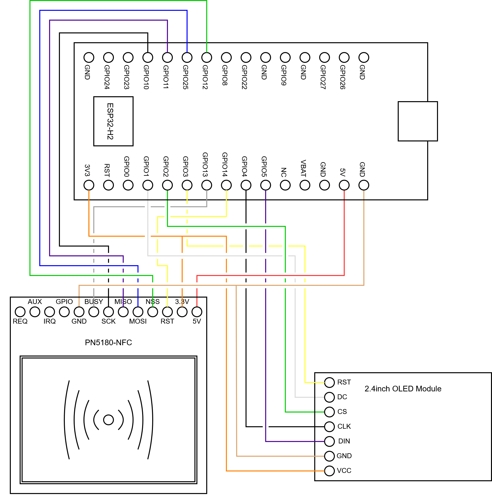

# ESP32 CGM Scanner

This project uses an ESP32-H2 with a connected PN5180-NFC reader and Display to interface directly with a Continuous Glucose Monitor (CGM). A CGM can be scanned via NFC, and the glucose data is read / decrypted and displayed on the screen.

It is only tested with a Libre 2 CGM, but could easily support other Libre monitors.

Extensions to the sensor class could enable other models to be supported if necessary.

Future work is needed to integrate BLE communication fully.

## [Doxygen Documentation](https://charclayt.github.io/esp32-cgm-scanner/html/)

## Wiring

<table>
<tr><th>ESP32-H2 -> PN5180-NFC</th><th>ESP32-H2 -> OLED Display</th></tr>
<tr><td>

| ESP32-H2  | PN5180-NFC|
|-----------|-----------|
|    GND    |   GND     |
|   IO13    |  BUSY     |
|   IO10    |   SCK     |
|   IO11    |  MISO     |
|   IO25    |  MOSI     |
|   IO12    |   NSS     |
|   IO14    |   RST     |
|   3V3     |  3.3V     |
|    5V     |    5V     |

</td><td>

| ESP32-H2 | OLED Display |
|------------|------------|
|    3V3     |    VCC     |
|    GND     |    GND     |
|    IO5     |    DIN     |
|    IO4     |    CLK     |
|    IO2     |    CS      |
|    IO1     |    DC      |
|    IO3     |    RST     |

</td></tr></table>
